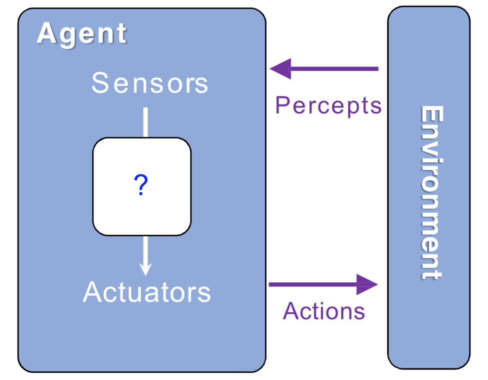

# 01 - Intro to AI, Rational Agents
   

UC Berkeley CS 188 Spring 2024 Course, Lesson 1
Thanks to ```Cameron Allen```, ```Michael Cohen``` and other course staffs

## What is Artificial Intelligence ?
- [01 - Intro to AI, Rational Agents](#01---intro-to-ai-rational-agents)
  - [What is Artificial Intelligence ?](#what-is-artificial-intelligence-)
    - [AI is having real-world impacts](#ai-is-having-real-world-impacts)
    - [Ok, but what actually is AI ?](#ok-but-what-actually-is-ai-)
    - [Rational Decisions](#rational-decisions)
    - [Perspectives on Intelligence](#perspectives-on-intelligence)
    - [What About the Brain ?](#what-about-the-brain-)
    - [A (Short) History of AI](#a-short-history-of-ai)
    - [What Can AI Do ?](#what-can-ai-do-)
    - [This Course : Designing Rational Agents](#this-course--designing-rational-agents)
    - [Course Topics :](#course-topics-)


### AI is having real-world impacts
Text assistants, Image generation and ..., who can live without it ? 
it has been impacted on economy, politics, law, labor (taking our jobs), sciences and educations
- The global AI market size till 2022 was USD 454.12 billion, now it is [USD 638.23 billion](https://www.precedenceresearch.com/artificial-intelligence-market). government is trying to controll this market which is why heads of AI companies meeting with the heads of The United States government even with heads of other countires. These companies have now a lot of political power.
- AI also impacts law, because we're trying to wrangle with what's the legality of these systems like ```when they are trained on these big datasets and these datasets just come from the internet and some of the internet is copyrighted```, [what happens ?](https://news.bloomberglaw.com/ip-law/ai-generated-art-lacks-copyright-protection-d-c-court-rules). we're still trying to figure out how to handle these kinds of things legally.
- There's the labor angle. there's always the jobs angle, so the AIs are going to come and take all our jobs. and so there are some articles that say [***watch out for the AI, it's coming for your jobs***](https://www.economist.com/finance-and-economics/2021/01/16/new-research-shows-the-robots-are-coming-for-jobs-but-stealthily) and there's are other articles that are like [***actually, we should be optimistic, they're not coming for all the jobs, maybe they're creating jobs too***](https://www.nytimes.com/2023/05/20/business/dealbook/the-optimists-guide-to-artificial-intelligence-and-work.html) and then there's articles that are like [***yeah, what jobs are they creating, globally? are these the jobs that we want them to create?***](https://www.marketplace.org/episode/2023/03/21/the-human-labor-behind-ai-chatbots-and-other-smart-tools)
- Meanwhile it's having an impact on science, like [AlphaFold](https://www.nature.com/articles/d41586-022-02999-9) discovery, which was a breakthrough in the protein-folding problem a couple of years ago and DeepMind won this big prize for basically you take a sequence of amino acids and then you figure out how it turns into a 3D protein object. this has been a long-standing problem in drug discovery and the life sciences, more broadly. even not just in discovery but in control like another DeepMind project which is [controlling nuclear fusion using AI](https://www.wired.com/story/deepmind-ai-nuclear-fusion/).
- And in education, then there's all these questions about why [ChatGPT should be banned in schools](https://www.forbes.com/sites/ariannajohnson/2023/01/18/chatgpt-in-schools-heres-where-its-banned-and-how-it-could-potentially-help-students/).

### Ok, but what actually is AI ?
What should we build ?
* Make machines that ***think like people*** ?
  * Classical cognitive science, neuroscience-style approach
  * But the thing is, we don't always know how people think, we just know that we can observe what they're doing so maybe it's better if we ...
* Make machines that ***act like people*** ?
  * Very old definition back to Alan Turing. the Turing Test is a classic example of this : ***If a machine acts like a person and it's indistinguishable in terms of behavior from a person, maybe that's the mark of intelligence***, any problem with this ?
    1. if you have a machine that's trying to pretend to be a human or trying to act like a person, to a certain extent, it's going to have to do things that human do. that might not be desirable liek getting wrong asnwers to math questions and having a favorite color.
    2. we have already about 8 billion humans, so do we really need to design systems that act like us and be what we are ? we have enough of those. 
* Make machines that ***think rationally*** ?
  * This is the classic aristotle version of intelligence, it's like ***have the right thought process, it should lead you to the right conclusions***. Its nice idea but it doesn't quite get you all the way there, because you can think forever and if you don't actually do something with all that thinking, it doesn't really mean that you've demonstrated being intelligent.
* Make machines that ***act rationally*** ?
  * This is the key to all of it. this course will take the stance that is the way to go about it.

### Rational Decisions
we'll use the term ```Rational``` in a very specific, technical way :
* ***Rational :*** maximally achieving predefined goals
* Goals are expressed in terms of the ***utility*** of outcomes
* World is uncertain, so we'll use ***expected*** utility
* Being rational means acting to maximize your expected utility

***It doesn't really matter how you're thinking, as long as your actions correspond to whatever brings about the biggest expected utility.***
A better name for this course should be ```Computational Rationality```.

### Perspectives on Intelligence
* **Skills-Based Perspective** : Intelligence is a collection of skills, means ***"if system can't do X, then it's not intelligence"*** or ***"a system is only intelligence if it can do X"***. But what are the tasks ? :
  * Play chess ?
  * Learn from experience ?
  * Use words properly ?
  * Make mistakes ?
  * Not make mistakes ?
  There is some contention, so what counts as intelligence and what doesn't count as as intelligence ? ***This perspective could give you a list of things that are necessary for intelligence, but doesn't necessarily mean that those things are sufficient for intelligence, it might not be enough, even if you could do all of these things, you might not be intelligent***. Also if you couldn't do one of these things, we would say that you're not intelligent, but that's also a problem because some might argue that not all of these things are necessary to be intelligent, so there is a famous essay by **Rodney Brooks** called ***Elephants Don't Play Chess***.
  So that brings us into another perspective in intelligence and this is the one that Rodney Brooks would have argued for which is the embodiment perspective :
* **Embodiment Perspective (Rodney Brooks)** : You need to have a body, you need to be situated in the world, you need to exist in relationship to an environment in order to be intelligent, and that you can't really get proper intelligent unless you have this situated, embodied, cognitive capability. and so he went off and founded [iRobot](www.irobot.com) and they developed Roomba vacuum cleaner. They're cool, they map your house and they figure out how they need to go around the chairs and the walls and then they firgure out where the dirt is and they vacuum it up. This is the great example of the embodied perspective which essentially it says ***start with a ground-up hierarchy, you want to start with the fact that there is a body, there is this embodied conscious or not conscious cognitive capability in the robot or in the agent, and then from there, you just build up this hierarchy of increasingly complicated behaviors until you can do useful things***.
* **Psychometrics Perspective (François Chollet)** : This is advocated by François Chollet, among other people, Essentialy the idea is, well, if we want to measure intelligence, why don't we measure it like we try to measure intelligence in other creatures, like humans ? We could subject these AI systems to an IQ test, give them these pictures and make them complete these tasks and if we do that and we subject them to a wide variety of tasks, a broad range of tasks, including tasks that were not previously known to the ability-enabled system or the designers, because if you just measure how well this thing does, and the designers know what the tests are, you can design a system that solves every test. and then it might not actually be the system's intelligence that you're measuring, it might be the designer's intelligence that you're measuring. So that would be a problem. So Chollet's idea is, no, ***we have to make sure that these are tests that the designers can't know about and that there's a broad variety of them, and they're measuring abilities, not skills. So abilities induce skill learning, learning efficiency is key here, but also this idea of a broad range. It's not enough to just be good at one thing***.
<div align="center">
  
</div>

* **Human-Compatible Perspective (Stuart Russel) :** Another important perspective on intelligence is the safty angle, Stuart Russel has been advocating for this idea of human compatibility, human-compatible AI. What Stuart would argue is, ***it's not enough to maximize expected utility. You have to maximize expected human utility, and it's not enough to just maximize it by telling the AI what the reward function is or what the utility function is. You have to make sure that the AI is initially uncertain about what that utility function is and it's going to learn it overtime and never be too sure that it is right, and in order to learn those preferences the information that it gets is by watching human behavior. So this is the ultimate source of truth about what humans want, is just watching what they do***. 
Overlall :
  * Machine's objective is to maximize ***human utility***.
  * Initially ***uncertain*** about human preferences.
  * Must learn about preferences from human ***behavior***.

* **Robert A. Heinlein's Perspective** : There is this really nice quote by Robert Heinlein :
  ***A human being should be able to change a diaper, plan an invasion, butcher a hog, conn a ship, design a building, write a sonnet, balance accounts, build a wall, set a bone, comfort the dying, take orders, give orders, cooperate, act alone, solve equations, analyze a new problem, pitch manure, program a computer, cook a tasty meal, fight efficiently, die gallantly. Specialization is for insects.***
  Wheter you agree with it or not, this is an interesting perspective on what it would mean to be a human being or what it would mean to be an intelligent creature.

### What About the Brain ?
Human minds are very good at making rational decisions, ***sometimes***. there are not perfect because sometimes we do something that we know later we would regret. why would we do that ? if we are rational creatures ?
That is one potential downside of having a biological brain. brains are not also as modular, it is hard to isolate pieces of bran that do various things as we do.

### A (Short) History of AI
* **Early days, neural and computer science meet** — ***1940 - 1950***
  * **1940 :** McCulloch & Pitts — Perceptron-boolean circuit model of brain (first neural network)
  * **1950 :** Turing — ***"Computing Machinery and Intelligence"*** (where he introduced Turing Test, arguments of why machines couldn't thing).
* **Excitement ! Logic Driven** — ***1950 - 1970***
  * **1950s :**
    * Early AI programs, including **Samuel's checkers program**
    * Newell & Simon's Logic Theorist
    * Gelernter's Geometry Engine
  * **1956 :** Dartmouth Meeting — ***"Artificial Intelligence"*** adopted
    > What did they wanted to do ?
    > * 2-months, 10-man study of artificial intelligence
    > * be carried out during the summer of 1956
    > * the studyis to proceed that ***every aspect of learning*** or ***any other feature of intelligence*** can in principle be so percisely described that a machine can be made to simulate it
    > * ***we think that a significant advance can be made*** in one or more of these problems if a carefully selected group of scientists work on it together for a summer on these tasks :
    >   * use language
    >   * form abstractions and concepts
    >   * solve kinds of problems now reserved for humans
    >   * improve themselves
    >
    > But its 2024 and some of those things are starting to happen, but at the end of summer they had not made as much progress as they expected to make
  * **1969 :** Minksky & Papert — perceptrons can't learn XOR/parity ! Maybe we should not use perceptrons, so they started working on knowledge-based reasoning approaches.
* **Knowledge-based approaches** — ***1970 - 1990***
  * **1969 - 1979 :** Early development of knowledge-based system — which was going really well
  * **1980 - 1988 :** Expert systems industry ***booms***; backpropagation makes it feasible to train multi-layer neural networks. but why big boom ?
    > We ask AI ***"All squares are shapes, all triangles are shape, is a square a triangle ?"*** and then it would say, not necessarily and we'd all clap and we'd say, yeah, that's correct.
    > but then we realized that these facts and these true-false binaries about the world aren't going to get us all the way there. how do you encode that into a knowledge-based system that only operates on these boolean quantities ?
    Well that's where they have a problem, which is, if you get an inconsistency in one of these knowledge systems, you suddenly can't make any claims anymore. it can prove anything is true even though not necessarily anything is always true.
  * **1988 - 1993 :** Expert systems industry ***busts*** : ***"AI Winter"***
    > So there was after there was this boom and then there was this bust
* **Statistical approaches, agents** — ***1990 - 2010***
  * Resurgence of probability, focus on uncertainty
  * Agents and learning systems ... ***"AI Spring ?"***
  * **1992 :** TD-Gammon achieves human-level play at backgammon
  * **1997 :** Deep Blue defeats Gary Kasparov at chess
  * **2002 :** ***Embodied AI*** Roomba vacuum invented
* **Big Data, GPUs, Deep Learning** — ***2010 - 2017***
  * **2011 :** Apple releases Siri
  * **2012 :** AlexNet (first neural network) wins ImageNet competition — part of GPU evolution
  * **2015 :** DeepMind achieves human-level control in Atari games — with same algorithm, that means getting closer to the idea of ***General Purpose*** behavior
  * **2016 :** DeepMind AlphaGo defeats Lee Sedol at Go
  * **2016 :** Google Translate migrates to neural networks
* **Scaling Up, Large Language Models** — ***2017 - Now***
  * **2017 :** Google invents ***Transformer** architecture — which is the thing that underpins all of these chatbots
  * **2017 :** DeepStack/Libratus defeat humans at poker
  * **2018 - 2020 :** AlphaFold predicts protein structure from amino acids
  * **2021 - 2022 :** Modern text-to-image generaton
  * **2022 :** OpenAI releases ChatGPT
  * **2023 :** Every other company also releases a chatbot

### What Can AI Do ?
* [x] Win against any human at chess ?
* [x] Win against the best human at Go ?
* [x] Play a decent game of table tennis ?
* [ ] Unload any dishwasher in any home ?
* [X] Drive safely along the highway ?
* [ ] Drive safely along streets of San Francisco ?
* [X] Buy a week's worth of groceries on the web ?
* [ ] Buy a week's worth of groceries at Berkeley Bowl ?
* [ ] Discover and prove a new mathematical theorem ?
* [ ] Perform a surgical operation ?
* [X] Translate spoken Chinese into spoken English in real time ?
* [X] Win an art competition ?
* [ ] Writean intentionally funny story ?
* [ ] Construct a building ?

So, do you notice any pattern here ? what is easy and what is still hard ?
* Physical things are harder ?

### This Course : Designing Rational Agents
Why do we keep saying agents ? we could say robots. but it might not have a physical body so we could just be working in simulation, as we just talked about. So ***An agent is a catch-all term, it means something with agency, means that it can make decisions*** :
* An ***agent*** is an entity that perceives and acts.
* A ***rational agent*** selects actions that maximize its (expected) ***utility***.
<div align="center">
  
</div>

* Charactristics of the ***percepts***, ***environment*** and ***action space*** dictate techniques for selecting rational agents.

So this course is about :
1. General techniques for a variety of problem types
2. Learning to recognize when and how a new problem can be solved with an existing technique

### Course Topics :
* **Search and Planning** :
  * How can i use ***model*** of the world to find ***sequence of actions*** to achieve my ***goal*** ?
* **Probability and Inference** :
  * How can i make sense of ***uncertainty*** ?
* **Supervised Learning** :
  * How can i learn a ***model*** of the world from ***data*** ?
* **Reinforcement Learning** :
  * How can i learn a ***policy*** for any situation so that i can ***maximize utility*** ?

> [!TIP]
> CS189 : Intro to Machine Learning
> CS182 : Deep Neural Networks
