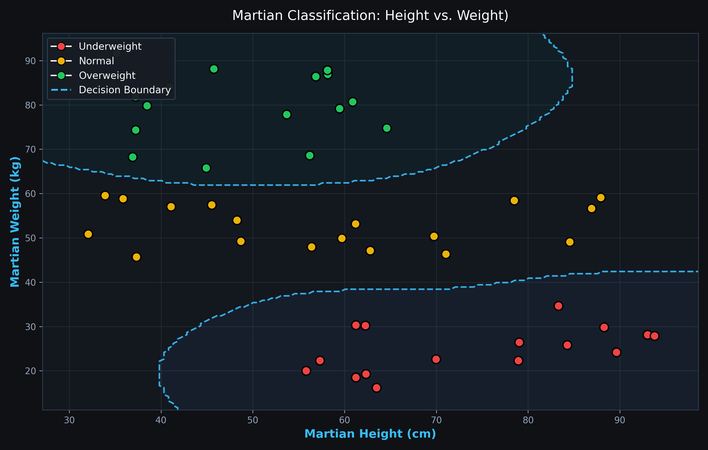
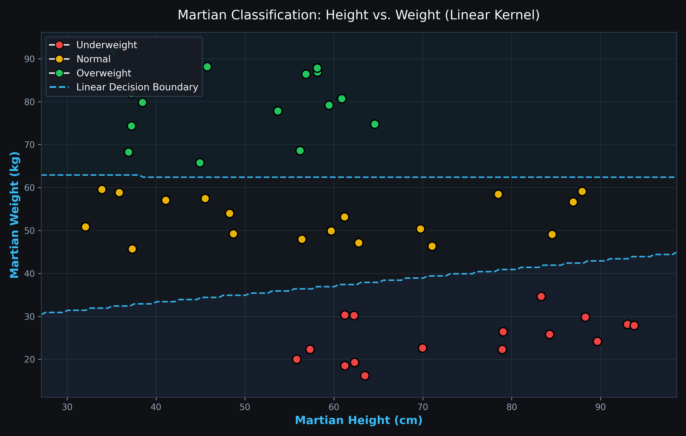
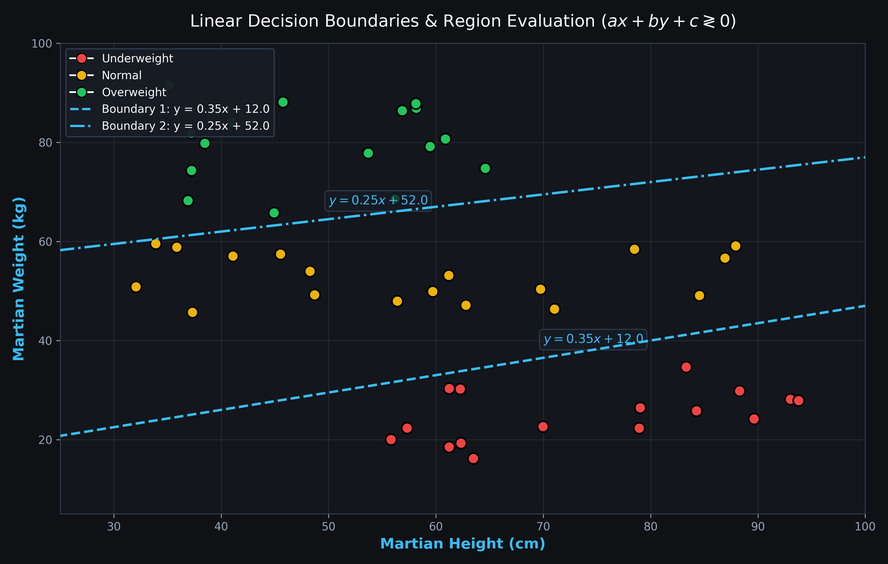
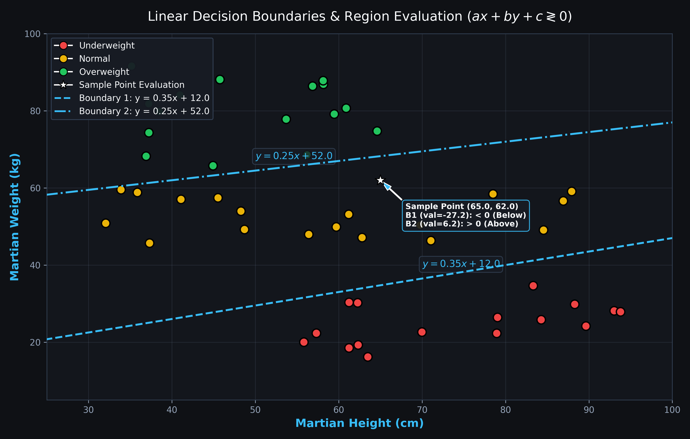
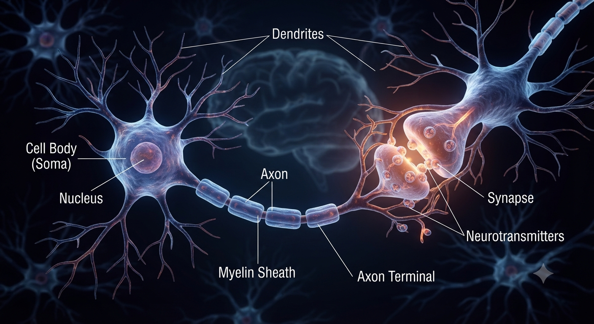
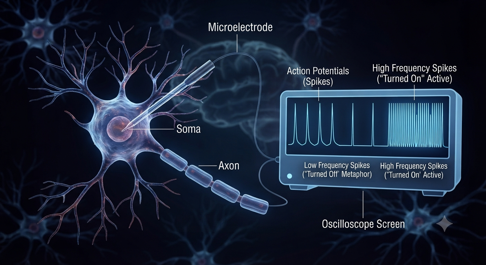

# 02 - ...
   

Sharifi Zarchi's Introduction to Artificial Intelligence Course, Lesson 2
Thanks to Professor ```Sharifi Zarchi```

## Traditional Programming vs Machine Learning
* **Traditional Programming** : We give ```Rules``` and ```Data``` to computers, then computers generate ```Answers```.
* **Machine Learning** : We give ```Data``` and ```Answers``` to model, then model extract ```Rules``` itself.

## What is Model ?
We give it ```Data``` and ```Train``` it to discover a ```Pattern``` (e.g. A pattern that help us determine dog or cat images). 

## Some of Problems in Machine Learning
* **Regression** : In this problem we try to predict a continuous number (e.g. price of house according to their area).
* **Classification** : In this problem we try to learn discrete categories (e.g. dog and cat image detection).

## Finding Patterns
Sometimes after illustrating our data we can discover some patterns. for instance, if we try to categorize martians by their weight, height, and label, we can generate this diagram by machine learning :
<p align="center">
  
</p>

As you see, according to weight and height of martians we can draw a ```Decision Boundaries``` in order to categorize them.
> [!TIP]
> In Machine Learning, the goal is to find these **Decision Boundaries**. when a new data appears on this diagram, model figures out which area does this data belong and label it according to area's label.

## Linear Classification
The simples way of classification is to draw linear decision boundaries like :
<p align="center">
  
</p>

However, the challenge is how to find these decision boundaries. humans manually use ```y = ax + b``` equation by checking where those lines cross the axes or estimating the slope (a) and y-intercept (b) based on visual intuition. By guessing points and testing linear equations :
<p align="center">
  
</p>

To evaluate whether a point falls on, above, or below a decision boundary programmatically, we can convert the standard slope-intercept form (y = ax + b) into the general linear form ```ax + by + c = 0```. For example, starting with :
* ```y = mx + b  (where m is slope, b is y-intercept, x is height, and y is weight)```
* We can rearrange all terms to one side : ```mx - 1.0y + b = 0```
* This matches the general equation: ```ax + by + c = 0```

Once the equation is in this form, we can plug in the coordinates (x, y) of any data point to determine its region using the following conditional statements :
* If ```ax + by + c == 0``` : The point lies exactly on the decision line.
* If ```ax + by + c > 0```  : The point lies on the upper/right side of the line.
* If ```ax + by + c < 0```  : The point lies on the lower/left side of the line.

For instance :
<p align="center">
  
</p>

> [!TIP]
> So we are training our model on previous data, but what is the model actually learning ? It is learning parameters of ```a``` and ```b``` in ```y = ax + b```. By saying machine learning, we mean learning these parameters.

However, a bottleneck persists because real-world problems are inherently complex rather than straightforward. Most of the times we cannot distinguish categories by linear classification models.
For solving these complicated problems, humans **have taken inspiration from the human brain**, just as they took inspiration from bird wings when designing airplane wings.

## Neural Networks
Neural networks are inspired by the structure of the human brain. They were designed to create a model that is much more intelligent and capable than the linear models we discussed earlier.

Similar to the human brain, these networks consist of neurons that are connected to each other across ```different layers```. The ```input layer``` receives raw data, the ```hidden layers``` discover complex patterns, and the ```output layer``` provides the final decision or prediction.

Our brain contains a large number of nerve cells called **Neurons**. These neurons work together and form connections called **Synapses**. Synapses are the points where the **Axons** of nerve cells connect and communicate with each other. Look at the image below :
<p align="center">
  
</p>

Now, if we place an electrode on this cell and connect it to a device, we can see that this nerve structure is generating electrical pulses called **Spikes**. At some points, the spikes become much less frequent, making it seem as if the nerve cell has turned off. Of course, it is not actually ```turned off```; this is just a metaphor. However, in another sense, we can also say that it is active or ```turned on```. Look at the diagram below :
<p align="center">
  
</p>

But how does this activation process actually happen ? If the signals coming from neighboring neurons are strong enough, they stimulate the neuron and cause it to become active. If the incoming signals are not strong enough, the neuron stays inactive.
In artificial neural networks, this decision-making process is modeled using what we call an **Activation Function**.

#### Today, Neural Networks form the foundation of modern Artificial Intelligence.

Suppose we have an image. This image is made up of many pixels. Each pixel has certain characteristics, such as its brightness level, which can be represented by a numerical value. For example, we can normalize pixel values and represent them with numbers between 0 and 1.
We feed each of these pixels into a neuron in the input layer. Then, in the hidden layer, we have another set of neurons. The connections between neurons are analogous to the synapses in the human brain. During the learning process, the strengths of these connections change. Some connections become stronger and transmit information more effectively, while others become weaker. We represent the strength of each connection with a value called a **weight**. For example, if a neuron outputs 1 and the connection weight is also 1, the transmitted value remains 1. If the weight is 0.5, the transmitted value becomes 0.5.
Now consider a neuron in the next layer receiving inputs from several neurons in the previous layer. Each incoming signal is multiplied by its corresponding weight, and the neuron computes the sum of all these weighted inputs.
Afterward, an **activation function** is applied. The purpose of the activation function is to determine whether the combined input is strong enough to activate the neuron and pass information to the next layer. In a simplified example, if the sum does not reach a certain threshold, the output may be 0; otherwise, it may be 1. In practice, many activation functions produce values anywhere between 0 and 1, such as 0.7.

An important point is that the **weights** associated with these connections **are the parameters of the model**. In other words, much of modern machine learning is based on neural network architectures and the values of these parameters. During training, the network learns by adjusting these weights so that it can make increasingly accurate predictions and decisions.

In essence, a neural network consists of two key components :
1. **The architecture of the network** (how neurons are connected).
2. **The parameters or weights** associated with those connections.

Training a neural network is fundamentally the process of finding the optimal values for these weights.

## Training Process
49:32